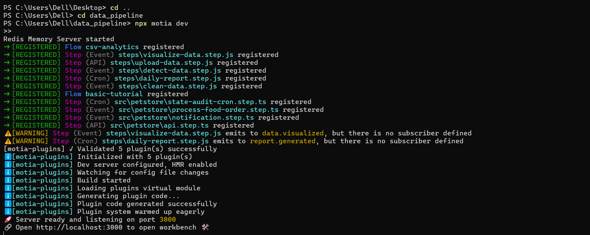

### Deployment via Motia Workbench (UI-based)

This project can be deployed directly from the **Motia Workbench** without using the CLI.
This method is recommended for users who prefer a visual, workflow-driven deployment.

---

### ⚠️ Important: Project Must Be in Running State

Deployment to Motia Cloud requires the project to be **actively running in Motia Workbench**.
A non-running project **cannot be imported or deployed**.

---

### Deployment Flow (Two Main Steps)

#### Step 1️⃣ Create and Run Project via Terminal / Workbench

1. Create the Motia project locally using the terminal
2. Start the project so that all steps are registered
3. Verify that **all states are running successfully**, including:
   - API steps
   - Background jobs
   - Orchestrator
   - AI agents
   - Streams
4. Confirm the project status in Motia Workbench shows **Running**

> The project must remain in the **Running** state for Motia Cloud to detect it.

#### Step 2️⃣ Import Running Project into Motia Cloud

1. Open **Motia Cloud**
2. Navigate to **Projects**
3. Select **Import Existing Project**
4. Choose the **running port name** exposed by Motia Workbench
5. Click **Deploy**

Motia Cloud will import the active project and deploy:
- REST APIs
- Background jobs
- Workflow orchestrator
- AI agents
- Streaming endpoints

### 🖼️ Screenshots

- **Motia Workbench** showing all states running successfully  
- **Motia Cloud** showing the project imported using the running port and deployed  

> Screenshots are provided for visual reference only.

